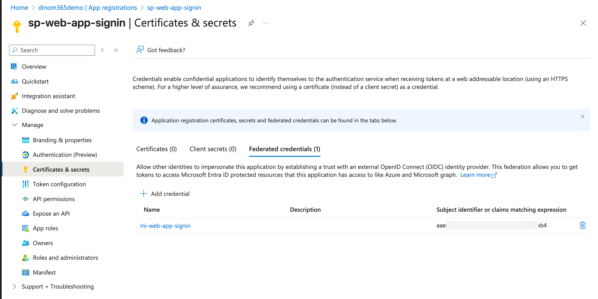
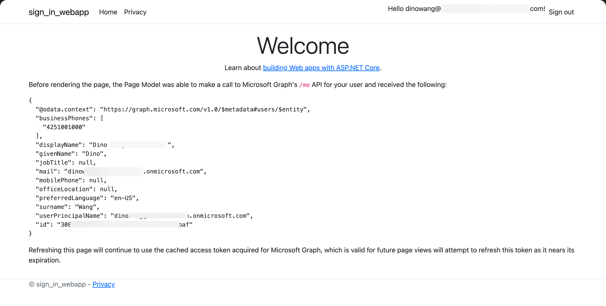

# Web Applications Sign-in using Managed Identity

With credential-less authentication becoming more prevalent, Microsoft.Identity.Web now supports using Managed Identity as a credential source for web applications.

appsettings.json
```json
{
  "AzureAd": {
    "Instance": "https://login.microsoftonline.com/",
    "TenantId": "52......-....-....-....-..........0e",
    "ClientId": "99......-....-....-....-..........f8",
    "ClientCredentials": [
      {
        "SourceType": "SignedAssertionFromManagedIdentity",
        "ManagedIdentityClientId": "2c......-....-....-....-..........54"
      }
    ],
    "CallbackPath": "/signin-oidc"
  },
  ...      
}
```

References:
[Credentials are generalizing certificates. | Microsoft.Identity.Web v2.1.0](https://github.com/AzureAD/microsoft-identity-web/wiki/v2.0#credentials-are-generalizing-certificates)

## Details

Create WebApp and User Assigned Managed Identity


Associate User Assigned Managed Identity with WebApp


Create Service Principal and setup Authentication Redirect URIs for WebApp


Create Federated Credentials for User Assigned Managed Identity


Setup appsettings.json for WebApp to use Managed Identity


Open WebApp and Sign-in with Managed Identity


